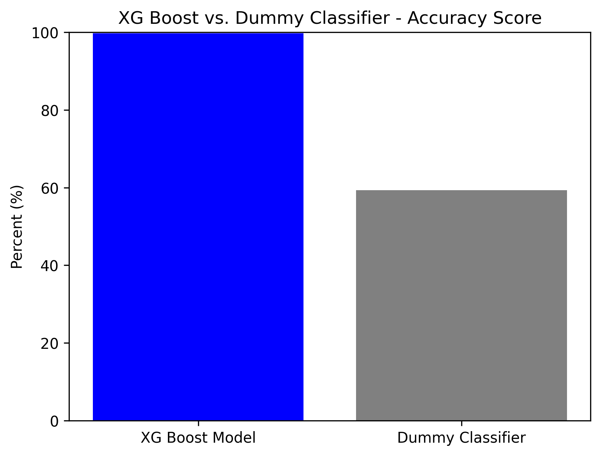
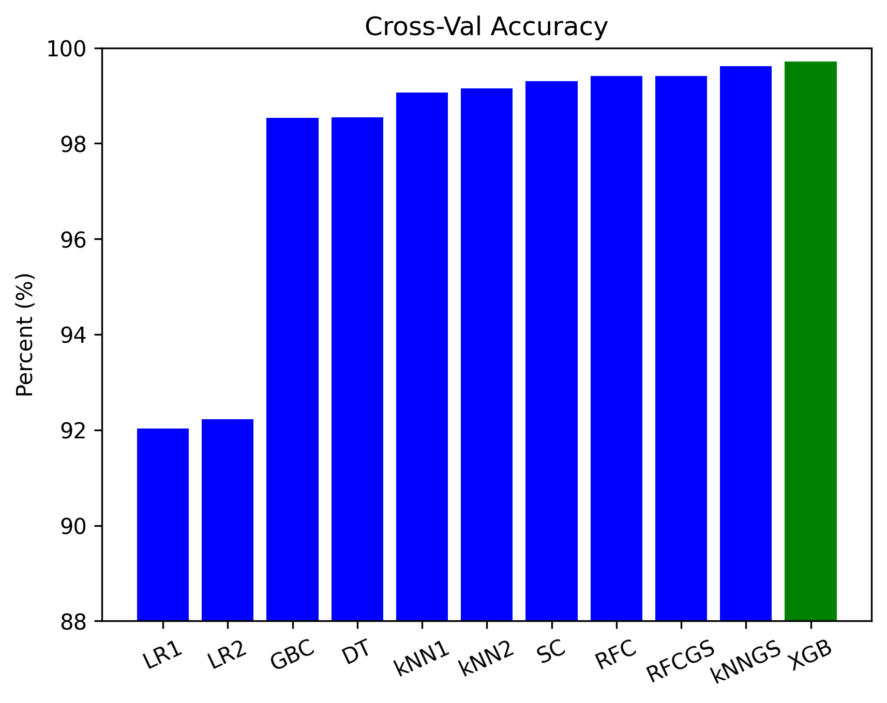
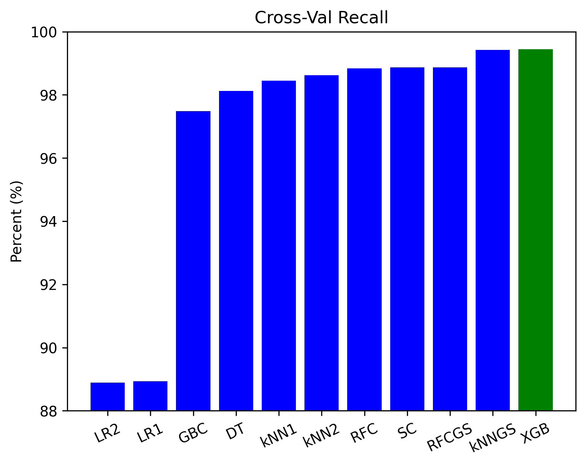
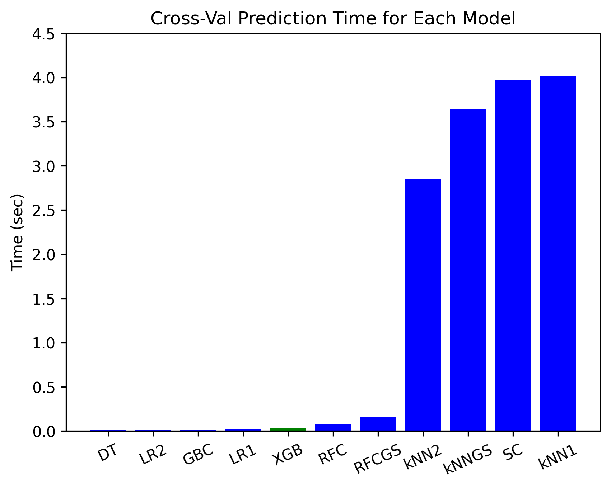
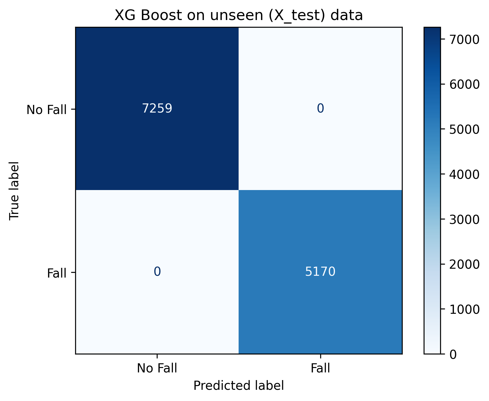
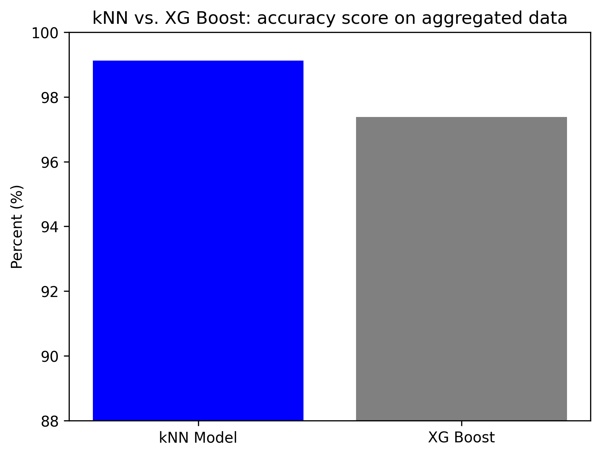
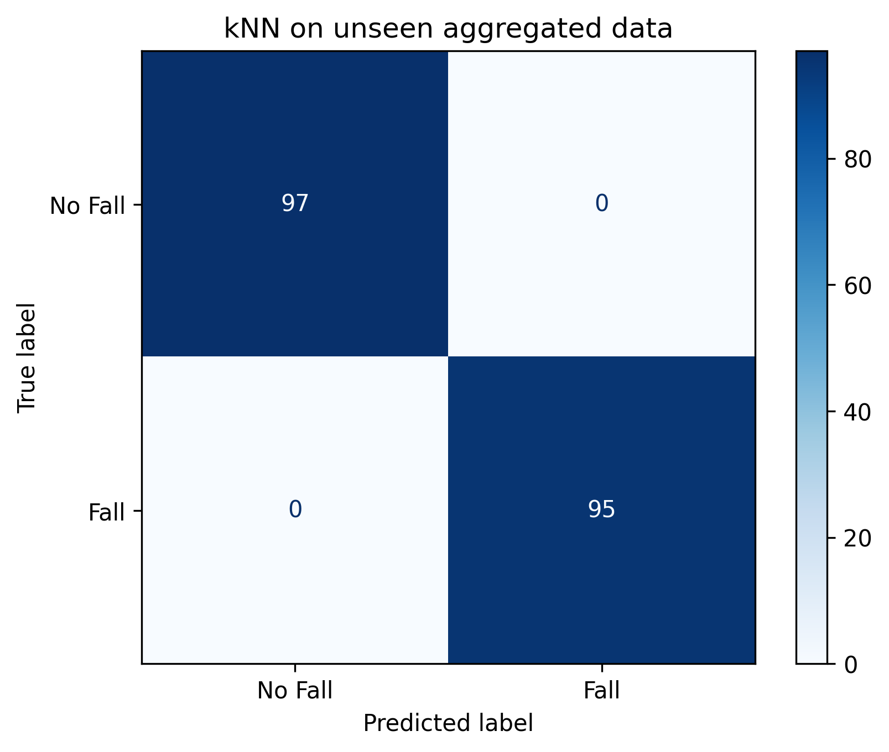

# Fall Detection Model

Author: Jon McCaffrey, PT, DPT

# Contents

### 1. [Overview](#overview)
### 2. [Business and Data Understanding](#bidness)
### 3. [Data Preparation](#dataprep)
### 4. [Modeling](#modeling)
### 5. [Final Model Evaluation](#final)
### 6. [Summary](#summary)
### 7. [Repository Structure](#repo)

# Overview

For my capstone project, I used the __[ARCO Research Dataset for Fall Detection](https://arcoresearch.com/2021/04/16/dataset-for-fall-detection/)__ which includes data from a single motion-sensor worn at waist height and collected from 17 different subjects as they performed both normal daily activities and simulated falls.  After repeated model iterations, I selected the XG Boost classifier algorithm, which was able to correctly predict whether or not a fall had occurred with the highest accuracy & recall, no false negatives, and a very fast prediction time as well.  This model could potentially be used in real-time to quickly alert family members or emergency personnel that a fall has occurred and help minimize injury and cost related to that fall.

# Business and Data Understanding

I will be presenting to Allison Oelschlaeger, the Chief Data Officer and Director of the __[Office of Enterprise Data & Analytics (OEDA)](https://www.cms.gov/about-cms/leadership/office-enterprise-data-analytics)__ at the Centers for Medicare and Medicaid Services (CMS) regarding the potential implementation of a fall detection model for elderly Americans at increased risk of falls in their home.  

Falls are the leading cause of fatal and nonfatal injuries among adults aged 65 and older in the United States, per the CDC __[[1]](https://www.cdc.gov/falls/data/index.html)__.  In 2015, about \$50 billion was spent on medical costs related to non-fatal fall injuries and \$754 million was spent related to fatal falls __[[2]](https://www.cdc.gov/falls/data/fall-cost.html)__.  As the number of Americans age 65 and older continues to grow, we can reasonably expect the number of falls and injuries related to falls to increase as well.   

 

__[from the CDC](https://www.cdc.gov/steadi/pdf/STEADI_ClinicianFactSheet-a.pdf)__

In addition to the potential injuries related to a fall, there are also social and emotional components to consider.  When a person has experienced a fall, they can develop an increased fear of falling, resulting in a decreased level of activity and social interaction, and therefore a decrease in quality of life __[[3]](https://www.cdc.gov/falls/facts.html)__.  

What role can machine learning play in reducing the impact of falls on the older population?  As a physical therapist who has worked in a variety of settings, I took an interest in an __[article](https://arxiv.org/abs/1707.03502)__ on deep learning and human activity recognition, and wrote a __[blog post](https://medium.com/@jonmccaffrey524/deep-learning-and-human-activity-recognition-98cb43da229)__ to summarize it. The main point, for me, is that there's a wealth of activity data available from our many internet-capable devices (smartphones, smartwatches, etc), but one significant challenge is: how can we process that information in an efficient and meaningful way?  Could this information be utilized in real-time to quickly alert family members or emergency personnel that a fall has occurred and potentially reduce injury and cost related to a fall?   Would such a system allow older adults to safely remain in their own homes for a longer period of time, rather than transitioning to more costly assisted-living environments?

The __[ARCO Research Group](https://arcoresearch.com/)__ from Spain has published a __[paper](https://arcoresearch.com/2021/11/23/the-shapes-smart-mirror-approach-for-independent-living-healthy-and-active-ageing/)__ related to a fall monitoring system, and made datasets from their research publicly available.  The data involves activity-monitor recording of 17 participants undergoing a variety of Activity of Daily Living (ADL) tasks as well as simulated falls.  The data was obtained __[here](https://arcoresearch.com/2021/04/16/dataset-for-fall-detection/)__, and downloaded as a .zip file.  The .zip file can also be accessed in the data folder after cloning down __[my GitHub repository](https://github.com/mccafj/Fall_Detection_Model/tree/main/data)__. There is code in the notebook to unzip the folder locally and create dataframes.  The only adjustment needed would be to specify the exact filepath to the uncompressed folders on your device after cloning down.  The .gitignore file already lists the uncompressed 'fall-dataset' and 'test_dataset' folders, to avoid pushing the uncompressed files to GitHub.  

The features include detailed sensor information for acceleration (in g, or 9.8m/s^2), rotation (in deg/sec), and absolute orientation in __[Euler angles](https://en.wikipedia.org/wiki/Euler_angles)__.  The sensor used in the study is a rechargeable __[MetamotionR sensor](https://mbientlab.com/documents/MetaMotionR-PS3.pdf)__ which includes a 3-axis accelerometer, 3-axis gyroscope, and a 3-axis magnetometer.  The absolute orientation of the sensor is calculated by an internal algorithm within the sensor, and expressed in terms of Euler angles (in this case, "roll" (X-axis), "pitch" (Y-axis), and "yaw" (Z-axis).  Below is an image of the sensor and its positioning at waist height on a subject in the study:

There are 3 different folders of CSV files in total.  Included in 2 of the 3 folders is a clear target (0 or 1) indicating if a fall occurred during the recording of the activity.  __[Previous work](https://arcogroup.bitbucket.io/shapes/fall_detection_system/)__ has been done by the authors to create a hybrid algorithm for fall detection, based on a Finite State Machine threshold algorithm, as well as an SVM (Support Vector Machine) machine learning algorithm.  Though I will not be following that hybrid model, I aim to try to replicate their findings while also building my own machine-learning understanding for human activity recognition tasks.  

The environment utilized for this modeling is outlined in the __[requirements.txt](https://github.com/mccafj/Fall_Detection_Model/blob/main/requirements.txt)__ document. Using Anaconda, I created a new environment, starting with Python initially, and subsequently pip installing streamlit (contains NumPy and Pandas), watchdog, matplotlib, seaborn, jupyter notebook, scikit-learn (contains joblib), and conda installing XG boost.

The entire modeling process was conducted on an HP Pavilion Laptop 15, with Windows 11 Pro version 22H2, a 12th Gen Intel(R) Core(TM) i7-1255U 1.70 GHz, and 16.0 GB RAM.

# Data Preparation:

The .zip file contains 3 folders of CSV files of data.  
- The 1st folder (fall-dataset-features) contains 17 CSV files (one for each participant) with all the aggregated features information (25 columns each, 45 rows each) representing summations of each of 45 total tasks, including simulated falls.  These files contain target information to determine whether the task involves a fall or not.     
- The 2nd folder (fall-dataset-raw) contains 17 CSV files with non-aggregated data (11 columns each, ~2900 rows each), summarized/indexed by the task being performed.  This also contains target information to determine whether the task involves a fall or not.
- The 3rd folder (fall-dataset-all) contains 17 CSV files of all the raw data for each participant (10 columns, ~30K rows) NOT summarized / indexed by task.  Though this is the largest source of information, there is no target included in the data.

The data types are all numeric (int or float), though that includes a 'feature' variable that represents different tasks / falls, a 'timestamp' variable, and the 0/1 boolean of fall occurrence.  The division between data that represent falls vs. non-fall tasks appears about evenly divided, so there is not a sizable class imbalance.  Also, the amount of data available for each task being performed (45 tasks total), for each participant (17 total), appears roughly equal.  

The libraries I used include Pandas, NumPy, scikit-learn, and matplotlib.  As far as preprocessing, the data is very clean with no nulls.

# Modeling

Before starting supervised learning models, I performed some unsupervised exploratory analysis, including Principal Component Analysis and KMeans clustering, to see if there were any inherent groupings among the data points.

In the end, PCA and KMeans clustering did not reveal any significant separation among clusters, based on n_components = 2 to maintain the ability to visualize the data.  This may be because only 39% of the variance is explained by limiting it to 2 components.  Onto supervised learning...

Initial modeling began with a train-test split, as well as creating pipelines and using a ColumnTransformer to streamline the modeling process.  The first simple model used was a dummy classifier, which used the strategy of predicting the 'most frequent' value in the target data.  In this case, that meant a 59% accuracy score because 59% of the target values indicated '0', or no fall. 

Additional models were evaluated via cross-validation, using accuracy, recall, precision, and F1 scores; as well as evaluation through confusion matrices and ROC curves.  The primary goals were to find the model with the highest accuracy in predicting fall vs. no fall, but also high recall to minimize the likelihood of "false negatives".  A false negative in this case would mean NOT predicting a fall when a fall had actually occurred.  This circumstance could be catastrophic to the injured party, due to the delays in notification to family and emergency personnel and therefore an increase in likely complications related to the fall.  The exact number of false negatives were visualized via confusion matrices.  I also tracked the time it took each model to predict/score during cross-validation to take into account computational expense.  

I progressed from the dummy model to logistic regression models, and accuracy and recall were dramatically improved, though there were still >1,600 false negatives.  I next trialled k Nearest Neighbors (kNN) models, including GridSearch, which further improved accuracy and recall, and with no false negatives/positives, but at the expense of increased computational demand, demonstrated by much longer prediction times.  My next iterations involved tree-based models, from a simple Decision Tree, through Random Forest (RFC), and then Random Forest with GridSearch.  Speed was much improved with those models, and though accuracy, recall & correct classification remained quite good, they were technically not as good as kNN.  I moved on to ensemble methods last, including Stacking Classifiers (default logistic regression, kNN, and Decision Tree), Gradient Boosting, and finally XG Boost. And the winner was... (**drum roll please**) 

XG Boost, even at its default hyperparameters, had the highest accuracy and recall, with very minimal overfitting, zero false negatives/positives, and a very fast score time.  Please see below for some visuals.

XG Boost may not technically be the fastest time, but it performs much better than the faster models (Decision Tree, Logistic Regressions, and Gradient Boosting) in all other metrics.  And XG Boost is much faster than the kNN models in terms of score time.

# Final Model Evaluation

First on the unseen X_test data from the train-test split:

The XG Boost model predicts all activities (ADL vs. fall) from the X_test data correctly and therefore has both zero false negatives and zero false positives.  The XG Boost model is also able to complete this 100% correct binary classification in ~0.02 seconds, which is consistent with its performance on the X_train data.

The ARCO Research also released a separate test dataset, which I avoided unzipping until my final model was chosen, to help minimize any potential data leakage.  Unfortunately, when I unzipped the files and created the dataframe, I realized it was missing three features that had been included in my modeling data so far, namely "Roll", "Pitch" and "Yaw".  How important were those features to my chosen model (XG Boost)?  Sadly, they were very important:

This resulted in 4 false negatives on this dataset:

Though that is only a 0.006% error, in real-life terms of both potential injury and cost, having a fall actually occur and not be reported could be catastrophic to the parties involved.  So considering how important the roll, pitch & yaw data was to my model, they would be necessary information for an XG Boost model being deployed.

As an aside, during this modeling process, I began to wonder: what if it is too computationlly expensive for second-to-second real-time modeling to monitor someone?  Could the system receive a snapshot of intermittent bundled updates (every 5 sec, or even 10 sec) to monitor someone's positionining and make aggregate calculations from that?  We could simulate that circumstance by using the fall-dataset-features files, which contains aggregate calculations.

After doing an initial train-test split and separate pipelines/ColumnTransformer, then comparing the two best algorithms from the prior work on fall-dataset-raw (XG Boost and kNN from the GridSearch), kNN had the clear edge on most metrics, though not quite on time.  

However, since time is less of a concern in this model using aggregated data, I proceeded with using the kNN algorithm, and ended up with high accuracy & recall on the fall-dataset-features test data, as well as 0 false negatives/positives in the confusion matrix.  

# Summary

As established at the beginning of this presentation, and as the director of CMS's Office of Enterprise Data & Analytics well knows, falls are a major concern for aging Americans, in terms of potential injuries / fatalities, cost of care, and overall quality of life.  The portion of the population age 65 and over is expected to continue to increase, as are the total number of falls and the injuries related to those falls.  As a physical therapist who has worked in a variety of settings, I believe there is great value in having real-time recognition of a fall event so family & emergency personnel can receive immediate notice and the person who has sustained a fall can receive prompt medical attention.  Perhaps if such a system existed in the United States, CMS may find there is a significant impact for cost-savings and quality of life.  

In addition to the original research related to this publicly-available ARCO dataset, my analysis provides further proof that data from a body-worn motion sensor, combined with a machine learning classification model such as XG Boost, can yield accurate and actionable information that would improve user safety and reduce costly medical complications related to falls.  There were many types of models to consider with this classification problem, and through the use of a variety of metrics (accuracy, recall, precision, F1 score, and prediction time), as well as assessment through confusion matrices and ROC curves, hopefully I presented a logical progression through the various models to reach the best conclusion. 

Also, as an alternative, if communicating real-time data is not ideal or feasible, then a separate k Nearest Neighbors model, using aggregated sensor data in a time-lapse window can also help verify accurate diagnosis that a fall has occurred and initiate emergent medical management for someone who has sustained a fall.

Thanks for reading :)

**For More Information:**

Please review the full analysis in my __[Jupyter Notebook](https://github.com/mccafj/Fall_Detection_Model/blob/main/Notebook_Fall_Detection_Model.ipynb)__ or the __[PDF of my slide presentation.](https://github.com/mccafj/Fall_Detection_Model/blob/main/presentation.pdf)__

For any additional questions, please contact Jon McCaffrey (jonmccaffrey524@gmail.com)

# Repository Structure

###### ├── __[README.md](https://github.com/mccafj/Fall_Detection_Model/blob/main/README.md)__
###### ├── __[Final notebook](https://github.com/mccafj/Fall_Detection_Model/blob/main/Notebook_Fall_Detection_Model.ipynb)__  <- Main notebook for project code
###### ├── __[Final slides](https://github.com/mccafj/Fall_Detection_Model/blob/main/presentation.pdf)__      <- PDF of presentation slides
###### ├── __[Reproducibility file](https://github.com/mccafj/Fall_Detection_Model/blob/main/requirements.txt)__   <- Information for reproducibility
###### ├── __[Data](https://github.com/mccafj/Fall_Detection_Model/tree/main/data)__			                          <- Location of zipped datasets
###### └── __[Images](https://github.com/mccafj/Fall_Detection_Model/tree/main/images)__                              <- Images used and generated in the project
